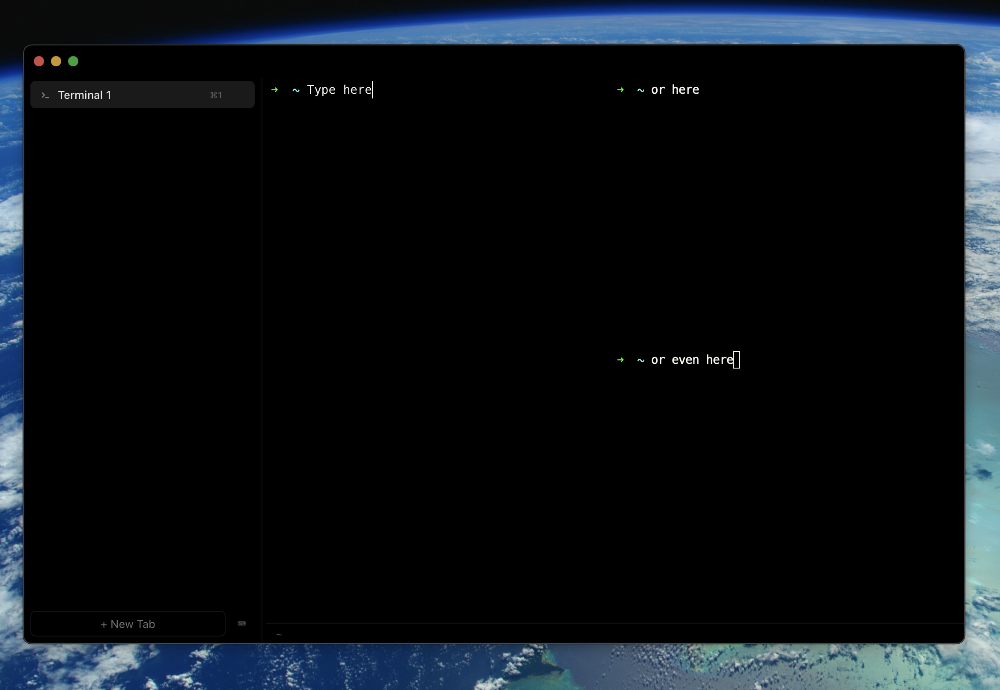

# Clawterm

[](https://github.com/clawterm/clawterm/actions/workflows/ci.yml)
[](https://github.com/clawterm/clawterm/releases/latest)
[](LICENSE)

Run a dozen AI agents at once and actually keep track of them.



## Why Clawterm

If you run Claude Code, Codex, or similar agents across multiple sessions, you know the pain: which tab is waiting for input? Which one errored? Did that build finish? Clawterm is a terminal built specifically for this workflow.

- **See everything at a glance** — vertical tabs show each session's state (idle, running, agent waiting, error) without clicking through them
- **Get notified, not interrupted** — desktop notifications when agents need input or long commands finish, so you can focus on the one that matters
- **Split and conquer** — horizontal and vertical splits let you run multiple agents side by side within a single tab
- **Stay organized** — pin tabs, mute noisy ones, drag to reorder, double-click to rename

Built with [Tauri 2](https://v2.tauri.app/) and [xterm.js](https://xtermjs.org/). macOS (Apple Silicon and Intel) and Windows (x64).

## Install

### macOS

```bash
curl -fsSL https://raw.githubusercontent.com/clawterm/clawterm/main/install.sh | bash
```

Or download the `.dmg` from the [latest release](https://github.com/clawterm/clawterm/releases/latest).

> **Note:** After installing from the DMG, you may need to run `xattr -cr /Applications/Clawterm.app` to clear the macOS quarantine flag. This won't be needed once Apple Developer Program approval is complete.

### Windows

```powershell
irm https://raw.githubusercontent.com/clawterm/clawterm/main/install.ps1 | iex
```

Or download the `.exe` installer from the [latest release](https://github.com/clawterm/clawterm/releases/latest) and run it. Windows 10 (1809+) or later required — WebView2 is included automatically.

### Uninstall

**macOS:** `curl -fsSL https://raw.githubusercontent.com/clawterm/clawterm/main/install.sh | bash -s -- --uninstall`

**Windows:** Use "Add or Remove Programs" in Settings, or: `irm https://raw.githubusercontent.com/clawterm/clawterm/main/install.ps1 | iex -- --uninstall`

---

Clawterm checks for updates automatically. When a new version is available, click **Update** in the sidebar to install and restart.

## Keyboard Shortcuts

| Action | macOS | Windows |
| --- | --- | --- |
| New tab | `Cmd+T` | `Ctrl+T` |
| Close tab | `Cmd+W` | `Ctrl+W` |
| Next / previous tab | `Cmd+Shift+]` / `[` | `Ctrl+Shift+]` / `[` |
| Jump to tab 1–9 | `Cmd+1` – `Cmd+9` | `Ctrl+1` – `Ctrl+9` |
| Quick switch | `Cmd+P` | `Ctrl+P` |
| Command palette | `Cmd+Shift+P` | `Ctrl+Shift+P` |
| Split right / down | `Cmd+D` / `Cmd+Shift+D` | `Ctrl+Shift+D` / `Ctrl+Shift+E` |
| Close pane | `Cmd+Shift+W` | `Ctrl+Shift+W` |
| Next / previous pane | `Cmd+]` / `[` | `Ctrl+]` / `[` |
| Cycle attention tabs | `Cmd+Shift+A` | `Ctrl+Shift+A` |
| Find | `Cmd+F` | `Ctrl+F` |
| Clear terminal | `Cmd+K` | `Ctrl+K` |
| Reload config | `Cmd+Shift+R` | `Ctrl+Shift+R` |

All keybindings can be remapped in the config file.

## Configuration

Config lives at:
- **macOS:** `~/.config/clawterm/config.json`
- **Windows:** `%APPDATA%\clawterm\config.json`

Created with defaults on first launch. Edit and press `Cmd+Shift+R` (macOS) or `Ctrl+Shift+R` (Windows) to reload.

```json
{
  "shell": "/bin/zsh",
  "font": { "family": "Menlo, Monaco, monospace", "size": 14 },
  "cursor": { "style": "bar", "blink": true },
  "sidebar": { "width": 200, "position": "left" },
  "theme": {
    "sidebar": { "background": "#000000" },
    "terminal": { "background": "#000000", "foreground": "#f8f8f2" }
  }
}
```

On Windows, the default shell is PowerShell (`pwsh.exe` if available, otherwise `powershell.exe`).

Only include keys you want to override — everything else uses defaults.

## Troubleshooting

| Problem | Platform | Solution |
| --- | --- | --- |
| App won't open ("damaged" or "unidentified developer") | macOS | `xattr -cr /Applications/Clawterm.app` |
| Commands like `npm`, `claude` not found | macOS | Ensure `.zshrc` exports PATH correctly |
| Commands like `npm`, `claude` not found | Windows | Ensure they're in your system PATH |
| Blank/white screen on launch | All | WebGL fallback is automatic — try restarting |
| WebView2 missing or outdated | Windows | Install [WebView2 Runtime](https://developer.microsoft.com/en-us/microsoft-edge/webview2/) |

## Building from Source

```bash
git clone https://github.com/clawterm/clawterm.git
cd clawterm
npm install
npm run tauri dev        # development
npm run tauri build      # production → src-tauri/target/release/bundle/
npm run preflight        # lint, format, test, typecheck
```

**Prerequisites:** [Rust](https://rustup.rs/) (stable), [Node.js](https://nodejs.org/) (v18+), macOS or Windows.

## Contributing

See [CONTRIBUTING.md](CONTRIBUTING.md). Bug reports: [open an issue](https://github.com/clawterm/clawterm/issues/new/choose). To release: `node scripts/release.mjs patch|minor|major`.

## License

[MIT](LICENSE)
